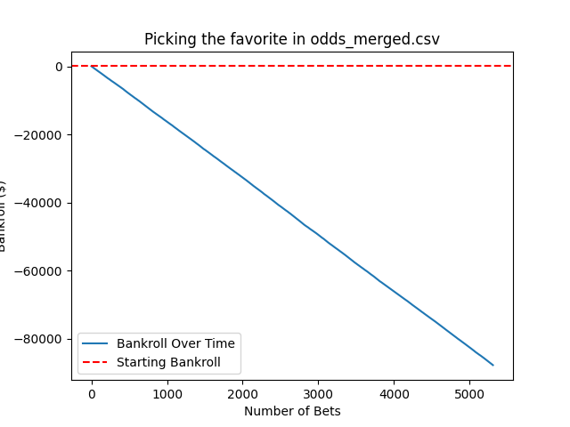
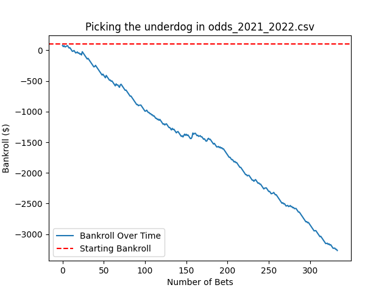

# Can You Bet On Every NFL Favorite Instead Of Opening An Index Fund?

## What Are Index Funds
Fifty years ago, people saving their money for the future often invested in actively managed funds. They trusted that the professionals running those funds knew enough about the stock market to reliably pick winning stocks and return a profit on their investment. In the book *A Random Walk Down Wall Street*, Burton G. Malkiel argues that their trust is misplaced. He cites several studies illustrating how picking a winning actively managed fund is just as difficult and risky as picking winning individual stocks to invest in since no one can predict the future of a stock based on its past. To use the stock market as a long term place to grow one's money one must instead invest in index funds.

Index funds are stock portfolios comprised of stocks from many different areas of the market. By distributing the investor's money across all these stocks the risks of each individual stock [offset each other](https://www.investopedia.com/investing/importance-diversification/). For example, if your money is wrapped up in the US automobile industry alone, when that industry has a bad year for one reason or another, you lose money. But if you also put some of your money in a different industry whose success is independent or even conversely related to the automobile industry, those stock's success will make up for your losses. Furthermore, the stock market as a whole increases in value over time due to technological advancements and other innovations, and index funds reflect the market's behavior in the long term.

### Drawbacks Of Reliability
Malkiel first published his book in 1973, around fifty years ago, and back then index funds were a radical new technology. However these days they are one of the most common ways people save for retirement, meaning that the amount of money wrapped up in the funds is larger than ever before. This is potentially dangerous for two reasons. One, if everyone is passively investing the [market is inefficient](https://www.theatlantic.com/ideas/archive/2021/04/the-autopilot-economy/618497/). New information about how good or bad a company is will take longer to be reflected in a stock's price than it otherwise would and, theoretically, terrible companies could stay afloat indefinitely.

In reality, that first disadvantage is offset by the fact that there will always be active managers taking advantage of the inefficiencies. The second disadvantage of index funds becoming increasingly popular  has already manifested itself. The people who run these passive funds [end up with an abnormally large stake](https://youtu.be/ZxZO0jd8VoU?t=211) in virtually every major company in the market, granting them an abnormally large amount of power over said companies. So, by investing their money in an index fund, what the average person is inadvertently doing is further consolidating control over the market amongst a small group of individuals.

## Experiment: An Index Fund Of Sports Teams
If in the short term buying and selling individual stocks is akin to gambling and in the long term an index fund of all stocks is a safe investment, are there any similar long terms patterns of growth to be found in sports betting? What would happen if we always bet on every favorite in the NFL ?

The scripts used to conduct this experiment can be [found here](https://github.com/bcbabrich/bcbabrich-sports-analytics/releases/tag/0.0.1).

### Scraping Historical Gambling Results
To answer this question we can run an experiment on historical gambling results. But first we need to find a corpus of that type of data. The website [oddsportal.com](https://www.oddsportal.com/american-football/usa/nfl/results/) has the betting lines and results for all the NFL games going back to the 2008-2009 season. Since their [robots.txt](https://www.oddsportal.com/robots.txt) does not specify the path `american-football/usa/nfl/results/` we are free to scrape the data from there.

The odds data returned by this website look like they are rendered after the initial page load. Can you find the `+173` in this chunk of HTML?

```
...
next-m:min-h-[26px] next-m:max-h-[26px] flex cursor-pointer items-center justify-center font-bold hover:border hover:border-orange-main min-w-[50px] min-h-[50px]" da    ta-testid="add-to-coupon-button"><p data-v-18e31eaa="" class="height-content !text-black-main next-m:min-w-[100%] flex-center min-h-full min-w-[50px] gradient-green     hover:!bg-gray-medium default-odds-bg-bgcolor border gradient-green-added-border">+173</p></div><!----></div></div><div data-v-18e31eaa="" class="flex-center border-    black-main min-w-[60px] max-w-[60px] flex-col gap-1 border-l border-opacity-10" user-settings="0"><!----><!----><div data-v-18e31eaa="" class="flex-center border-bla
...
```

As a consequence our script does two things.
1. It uses the Selenium testing framework. With this we can [run a headless browser](https://www.zenrows.com/blog/selenium-python-web-scraping#set-up-headleass-mode) and use `window.scrollTo` to prompt the framework to finish rendering its data.
2. It uses regular expressions to find and extract the odds data, rather than XPath or CSS selectors. There is no way to know these ahead of time.

The data looks like this after being scraped. It is only the odds and the results of the games, not which teams were playing or when.

```
away,home,winner
+114,-133,1
-244,+200,1
-244,+225,0
+154,-169,0
-278,+250,0
...
```

## Running Betting Strategy Experiments 
Once all the data is available as CSVs we can loop over every game and calculate how much money we would make or lose using a given strategy.

### Picking Our Betting Strategies
The odds we scraped are expressed in the American odds format, so we use the corresponding formula.

*"The moneyline calculator formula for negative odds is (100 / odds) x $50 ... to calculate positive odds, you divide the bookmaker’s odds by 100 and multiply that number by your wager"* [Vegas Insider](https://www.vegasinsider.com/moneyline-calculator/)

In this experiment there are three exceedingly basic strategies to choose from
- Always bet on the underdog (the team with positive odds)
- Always bet on the favorite (the team with negative odds)
- Flip a coin to choose between the underdog and favorite

### Graphing The Results
The results are abysmal. It is almost as if bookies actually anticipated these strategies and set their lines in a way to make sure they are not profitable. All three strategies illustrate a smooth descent into poverty when applied to all the data.



On any given season we can see that there are some fleeting moments of hope but no reason to quit your day job.



## Conclusion
The key difference between the stock market and sportsbooks in this context is that prices of stocks are determined indirectly by human behavior and prices of bets are set manually. An index fund is a safe investment because no person can alter human behavior and we can feel secure in the knowledge that the macro behavior of the market is the same as it was a hundred years and it will be the same in a hundred years. Sportsbooks set their lines not according to macro trends but according to whatever will yield the most profit for them.

The strategies tested in our experiment above are nowhere near as complex as those used to set up and manage a real-world index fund. Most importantly they do nothing to try and balance out the risks of each game, as an index fund would do when picking its stocks. The next evolution of this experiment should include which teams are involved in each game so that we can see what happens when we weight picks based on how risky they are given a team's recent performance.
