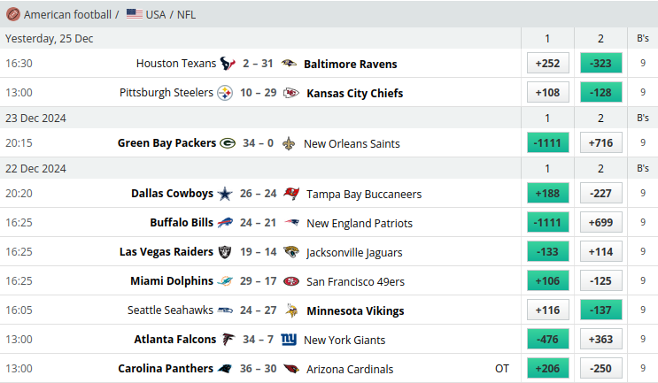
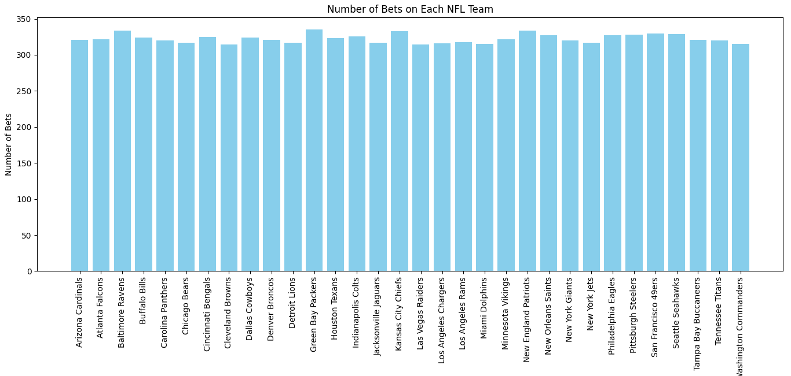
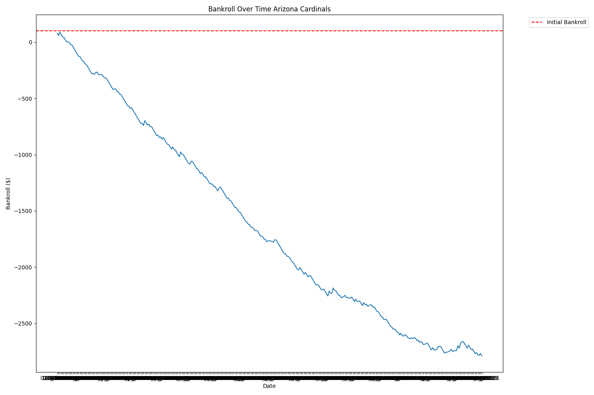
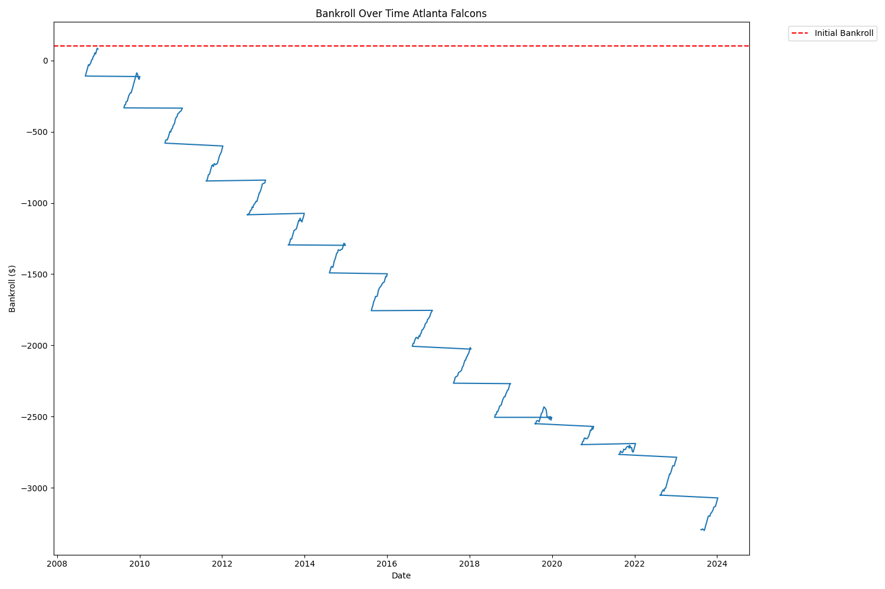
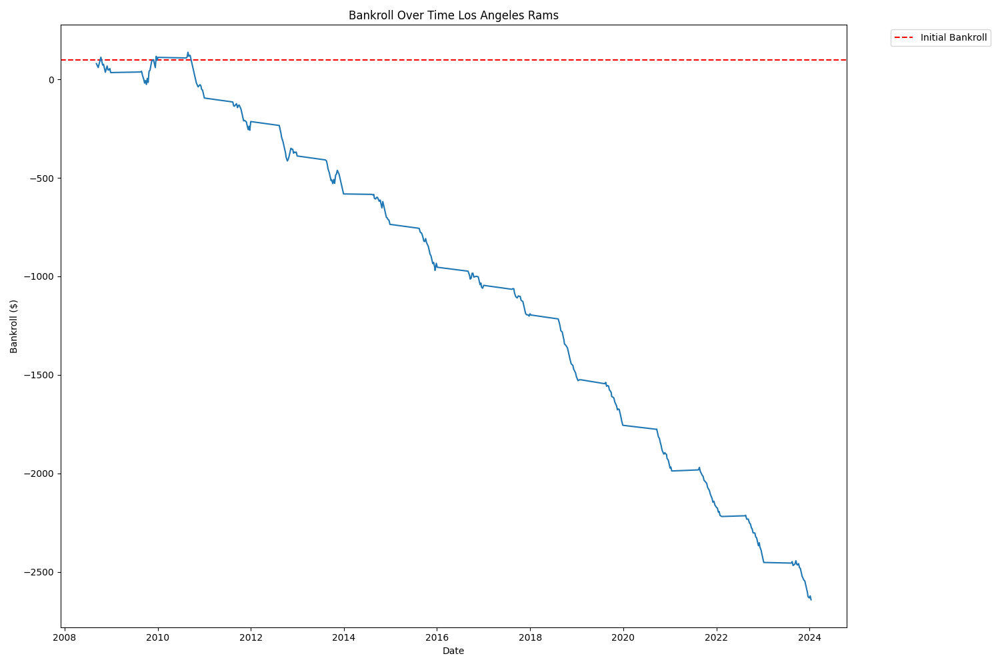
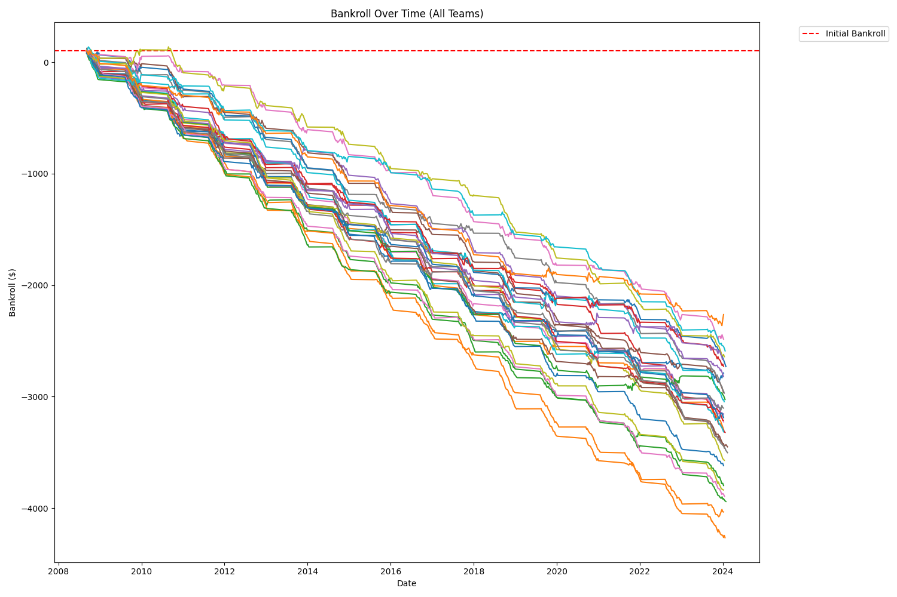
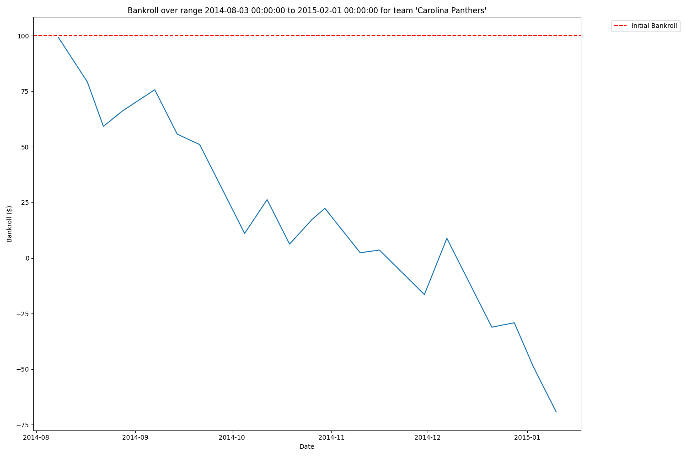
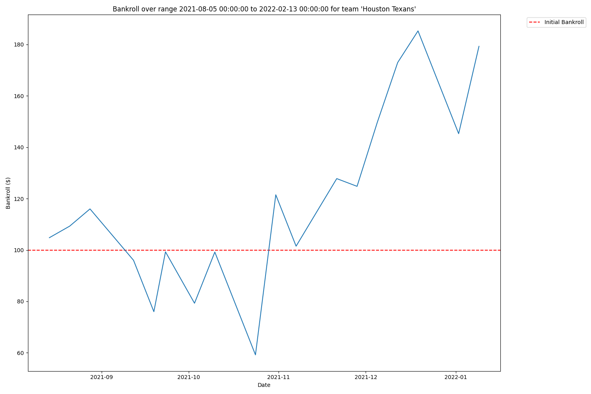
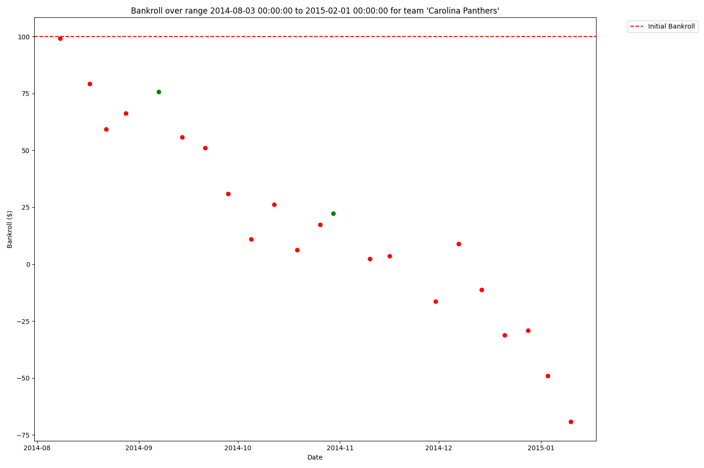
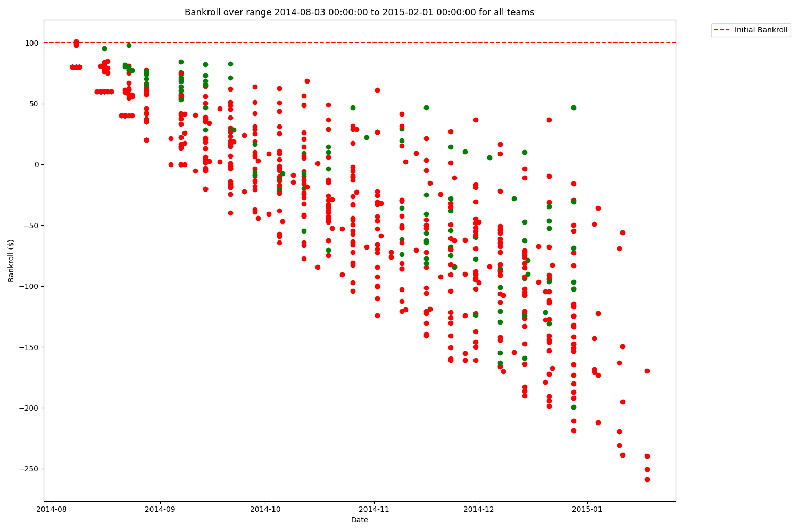

# Scraping Team And Date Info To Find Local Maxima

## Locating The Game Info Rows
Last time I scraped the odds and winner information from each game on [Odds Portal](https://www.oddsportal.com/american-football/usa/nfl/results/). But I'll need a lot more data to discover any long term upward trends. In this article I show how I used Beautiful Soup 4 in addition to Selenium to scrape team and date information from each game. Then I validate my data by visualizing very simple patterns.

All the code used to write this article can be found on [my GitHub](https://github.com/bcbabrich/bcbabrich-sports-analytics/releases/tag/0.0.2).

First I used Selenium to [find the element](https://selenium-python.readthedocs.io/locating-elements.html) with the CSS selector `class="min-h-[28px]"`. This CSS points to where all the game info is on the page. It is a brittle scraping strategy because that minimum height might change. The `div` nesting structure I'm about to describe is also brittle for the same reason. We can't control when Odds Portal will decide to roll out and update to these pages.



## Scraping Data Onto CSV
Ignoring that, I [got all the HTML inside that Selenium element](https://stackoverflow.com/questions/7263824/get-html-source-of-webelement-in-selenium-webdriver-using-python), then switched over to using Beautiful Soup 4 and [read the current div](https://www.crummy.com/software/BeautifulSoup/bs4/doc/#navigating-using-tag-names) via its tag name. This `div`'s [children](https://www.crummy.com/software/BeautifulSoup/bs4/doc/#contents-and-children) were the game rows with the information I needed.

After an entire loop of BS4 and Selenium running one after the other, I got this raw data:

```
Away Team,Home Team,Away Odds,Home Odds,Winner,Date
Houston Texans,Baltimore Ravens,+252,-323,1,Yesterday, 25 Dec
Pittsburgh Steelers,Kansas City Chiefs,+108,-128,1,_
Green Bay Packers,New Orleans Saints,-1111,+716,0,23 Dec 2024
Dallas Cowboys,Tampa Bay Buccaneers,+188,-227,0,22 Dec 2024
Buffalo Bills,New England Patriots,-1111,+699,0,_
Las Vegas Raiders,Jacksonville Jaguars,-133,+114,0,_
Miami Dolphins,San Francisco 49ers,+106,-125,0,_
Seattle Seahawks,Minnesota Vikings,+116,-137,1,_
Atlanta Falcons,New York Giants,-476,+363,0,_
Carolina Panthers,Arizona Cardinals,+206,-250,0,_
Chicago Bears,Detroit Lions,+256,-323,1,_
Cincinnati Bengals,Cleveland Browns,-526,+400,0,_
Indianapolis Colts,Tennessee Titans,-204,+171,0,_
New York Jets,Los Angeles Rams,+136,-159,1,_
Washington Commanders,Philadelphia Eagles,+181,-222,0,_
Baltimore Ravens,Pittsburgh Steelers,-357,+281,0,21 Dec 2024
...
```
### Data Cleaning
The script isn't perfect, sometimes Odds Portal will time out, or they will return an empty `div`, and occasionally the page will load just the games will be cancelled and intterupt the loop. If anything goes wrong on a season's run it is much better to fail there and have a log to look back on.

I scraped each season one at a time and it took aronud three hours I think, all in all. After the data was available locally, there are some shell scripts I created in order to have one source of input for the experiment script. They merged the CSVs together and dropped down the date column.

## Finding Back To Back Winners
### Double Checking The Distribution
Some teams go to the playoffs and some don't, but the distribution of the number of bets per team should even out, especially over eighteen seasons. [1](https://matplotlib.org/stable/api/_as_gen/matplotlib.pyplot.bar.html)



## Plotting One Team At A Time
At first, all the dates are all squished together when I graph over time. [1](https://matplotlib.org/stable/api/_as_gen/matplotlib.pyplot.plot.html)



I can explicitly read in the `Date` column as a Date type [1](https://matplotlib.org/stable/gallery/ticks/ticks_too_many.html#example-3-strings-can-lead-to-an-unexpected-order-of-datetime-ticks) [2](https://pandas.pydata.org/docs/reference/api/pandas.DataFrame.astype.html), but even when I do that, the graph is still messed up. Why?



Then I took a look at the screenshot of Odds Portal from above... and noticed each page displays the games in descending order, from most recent to least. Sorting on the pandas data frame got me the view I expected.



The plateaus must be when the bankroll remains static during the off-season. Matplotlib programmatically adds in the dates that aren't actually in the data, since we specified its type.

## Plotting All Teams Over All Time
Here is what all the teams graphed together over all time looks like.



The only team to ever be up against the books even for a small amount of time was the Los Angeles Rams.

## Finding Local Profits Across All Teams
What happens if we specify date ranges to zoom in on some of the rare seasons when the books lost money to a team? [1](https://pandas.pydata.org/docs/reference/api/pandas.Timestamp.html). For example, in 2014 some fleeting wins were had by the Panther bettor.



And, notably, Texans fans had an all-time season in 2021-2022. 



## Local Maxima As Back To Back Winners
There are many ways of defining "local maxima" on data like this, but for now we can search for back to back winners. These are games where, provided they were solely betting on this team all season, the bettor wins and makes money. 

Intuitively one senses there are not very many games like this. So we need to ditch the lines in our plot graph. Then, via numpy arrays and masks,we can color our bankroll red or green depending on if we are making or losing money [1](https://matplotlib.org/stable/gallery/color/color_by_yvalue.html) [2](https://numpy.org/doc/2.1/reference/generated/numpy.array.html) [3](https://numpy.org/doc/stable/reference/maskedarray.generic.html). 



## Back To Back Winners Across A Whole Season
Applying this to all teams over all seasons is too much for matplotlib, but for a single season we can all back-to-back wins for any given tea in a season.



## The House Always Wins
Thinking that you can beat the house is a [designed mistake](https://www.youtube.com/watch?v=2eNBfXb-A-Q&t=33s). It would be hard to find a bettor who has an upwardly trending bankroll history. But, clearly it is possible to beat the books, as many bettors publicly state that they advanced computer models are part of their successful careers in sports gambling [1](https://www.sharpfootballanalysis.com/betting-packages/) [2](https://oddsmatrix.com/top-sports-bettors/). I am learning what these methods are by my own reasearch.
- What dimensions can we search across to find patterns?
	- Do the teams that win organize into separate bands of similar return?
	- There appear to be more wins at the beginning of each season. How about the post-season?
- What are some alternative, more sophisticated definitions of local maxima?
	- "The total profit over the last 5 games is greater than 0"
	- Track the "velocity" of a team's ability to win over time. Do teams "get hot" against the books, resulting in spurts of profits?
- What is [arbitrage betting](https://www.youtube.com/watch?v=gsXcOpmf75U)? What statistical or otherwise mathematical methods are involved?
- Can we apply [Baye's probability](https://www.mathsisfun.com/data/bayes-theorem.html) here somehow? *"The probability of a winning the current game given that the previous game was a winner is equal to the probablility that the previous game is a winner given that the current game is a winner, times the probability that the current game is a winner, divided by the probability that the previous game is a winner"*
