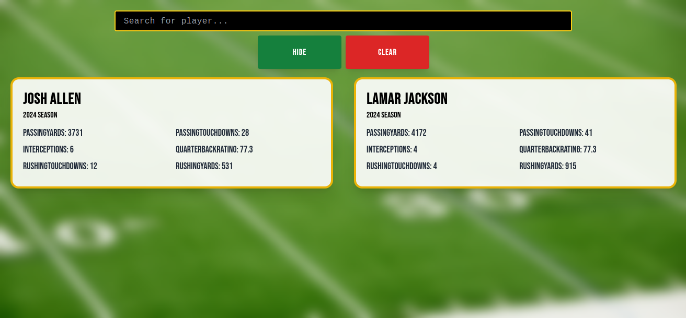
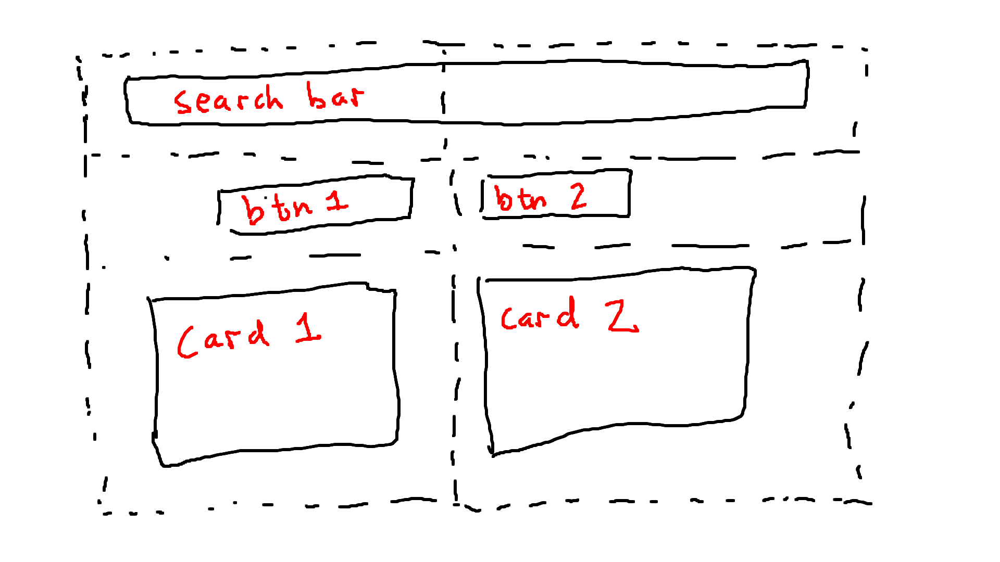
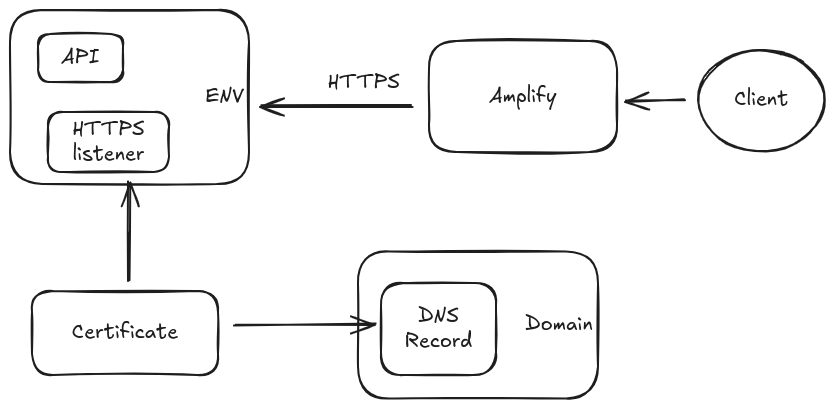

# Blind Resume Application



## Introduction
Although my background is in full stack engineering, I've never built a full stack engineering app entirely on my own and in the "real world". To prove to myself that I could, and maybe make some money along the way, I built a 3-tier web application and hosted it on AWS in an attempt to automate the generation of "blind resumes", a popular way of comparing two athletes by their statistics alone. Along the way I learned about prompt engineering, cloud networking, and copyright law.

I first learned what a blind resume is listening the podcast [Pardon My Take](https://www.youtube.com/watch?v=3Ma8tSwdSMI&t=1880s). I thought the process of searching over athletes, pulling their statistics, and then hiding their names seemed pretty straightforward. The UI would only need a search bar, two buttons, and two cards, assuming we only ever compared two players.



## Datasource
The two most important data features I needed were
- Searching over players
- Getting statistics for a player

By Googling a bit I found [this list](https://gist.github.com/nntrn/ee26cb2a0716de0947a0a4e9a157bc1) of public ESPN APIs, which has an `/athletes` endpoint that GETs a list of players. For the statistics, at first I wanted to scrape data from [Pro Football Reference](https://www.pro-football-reference.com/), but then I realized there was a `/statistics` endpoint in this list as well.

## Architecture
I chose a [three-tier architecture](https://www.ibm.com/think/topics/three-tier-architecture) because I needed a way to search over the database of players once it had been populated and the easiest way to do that was with an API. I've worked with MongoDB before so I chose to use [SpringBoot and MongoDB](https://www.mongodb.com/resources/products/compatibilities/spring-boot) for my midtier and [Angular](https://angular.dev/) as my client. For an extra bit of style and fun, I also used [TailwindCSS](https://tailwindcss.com/) on the front end.

## Hosting
Before this side project I had never deployed an application on my own to the public internet. I decided to use AWS since I assumed it would have the most up to date tutorials.

### Beanstalk
[Beanstalk](https://aws.amazon.com/elasticbeanstalk) lets anyone upload a jar they've built and deploy it to the AWS cloud. There are other ways of deploying such as the [EB CLI](https://docs.aws.amazon.com/elasticbeanstalk/latest/dg/eb-cli3-configuration.html), but I never got any of them working. AWS is a huge platform and there are bound to be [issues](https://github.com/aws/aws-elastic-beanstalk-cli-setup/issues/141) with some of their products at any given time.

### Amplify
[Amplify](https://aws.amazon.com/amplify/) is a service for hosting full stack web applications but here I used it for the front end only. I wll say that this was the easiest part of deploying to AWS. I followed their tutorial to set up an Angular repository and was deploying withing the hour, after fixing up some classic NPM install issues.

### Route 53
After I deployed my front and back end I was met with a [mixed content](https://developer.mozilla.org/en-US/docs/Web/Security/Mixed_content) error. This was because Amplify deployed my app from a secured server via HTTPS but my Beanstalk app was not secured. To fix the issue I had to
1. Register a custom domain using [Route 53](https://aws.amazon.com/route53/)
2. Create an A record inside the domain pointing to the Beantalk deployed URL
3. Request an SSL certificate pointing to the subdomain
4. Create a CNAME record pointing to the SSL certificate and wait for it to be validated
5. Register an HTTP listener on the Beanstalk load balancer



# Prompt Engineering
I tried to use AI as much as possible while building this project to keep my "prompt engineering" skill sharp. By using AI, I mean the free version of ChatGPT and Claude via their browser chat. I found that I got the most out of AI when I kept the context window small and attempted to answer my own question first.

Here is an example prompt that got me past a particularly weird CSS bug:

```
There is empty space at the bottom of the screen on my app that is not supposed to be there.
I have no idea how to get rid of it. I've tried
	- zooming in and out on the browser
	- adding min-height-screen to the HTML element and the body element
	- testing on Firefox and Chrome

I added * { border: 1px solid red !important; } to styles.css to put a red border around every element on the page.
Attached is a screen shot of what the empty space looks like.

When I inspect the page I don't see any elements in that space at all.
The HTML element encompasses everything above the empty space.

Any idea what is going on?
```

# Legality
I had originally hoped to monetize this project, but right before I began the process of signing up for Google AdSense I had the thought: "wait... if I'm using the ESPN API to create a database of players AND to get their statistics, can I make money of it myself?" I'm glad I did because I found out that ESPN is owned by Disney, and their [Terms of Service](https://disneytermsofuse.com/english/#Usage-Rules) clearly state:

"You agree that you will not ... copy or extract the Disney Products using a robot, spider, script, or other automated means ... for the purposes of ... creating or contributing to any collection of data, data set or database"

ChatGPT did help me find out that, according to U.S. law, "facts are not copyrightable" [Feist v. Rural (1991)](https://supreme.justia.com/cases/federal/us/499/340/). So, technically, if I create my database of players and their statistics by hand, then I won't get sued by Disney.
